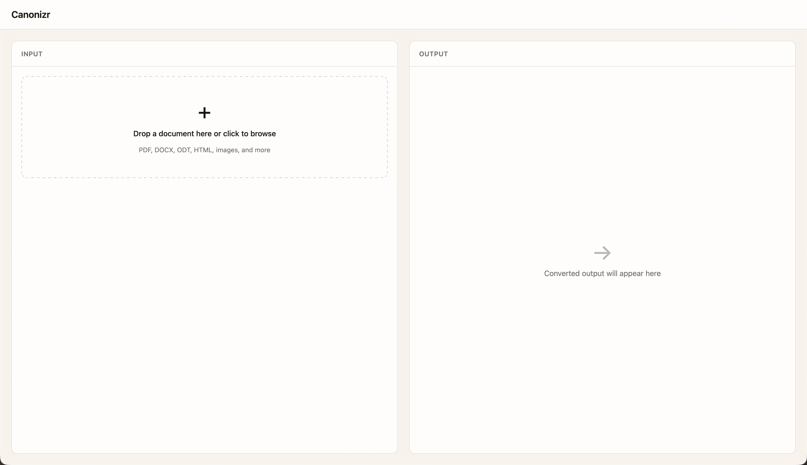

# Canonizr

On-device document extraction pipeline. Converts any document into LLM-ready markdown.

## Quick Start

```bash
git clone <repo-url> && cd canonizr-pipelines
./bin/setup.sh
docker compose up
```

Then convert a document:

```bash
./cli/canonizr convert document.pdf
```

## What it does

Send any file in, get markdown out. PDFs with complex layouts, scanned documents, images, office files — all handled locally, no data leaves your machine.

See [filetypes.md](filetypes.md) for the full list of supported formats.

## CLI

```bash
./cli/canonizr convert <file>          # markdown to stdout
./cli/canonizr convert --json <file>   # full JSON response with metadata
./cli/canonizr health                  # check if the service is running
```

## Web UI



The web interface provides drag-and-drop document conversion in the browser. Requires the pipeline to be running.

```bash
cd web
npm install
npm run dev
```

Then open http://localhost:5173.

## Scripts

| Script | Purpose |
|---|---|
| `./bin/setup.sh` | One-time configuration (writes `.env`) |
| `./bin/setup.sh --no-captioning` | Setup without the captioning VLM (~6 GB smaller) |
| `./bin/up.sh` | Start the pipeline |
| `./bin/down.sh` | Stop the pipeline |

## Requirements

- Docker + Docker Compose
- ~8 GB disk (~2 GB without captioning)

## Configuration

All configuration lives in `.env`. Copy from `.env.example` or run `./bin/setup.sh`.

## Architecture

| Service | Role |
|---|---|
| **Gateway** | Format detection, routing, MarkItDown, pymupdf, Pillow |
| **Docling** | PDF layout analysis, table extraction, figure classification |
| **Captioning** | On-device VLM (Gemma 4) for images, figures, scanned pages |
| **LibreOffice** | Legacy format conversion (DOC, PPT, XLS, Apple formats) |

Only the gateway port is exposed. All services communicate internally over the Docker network.

## OpenClaw Integration

Canonizr can be used as an OpenClaw skill. See `SKILL.md` for agent integration details.

